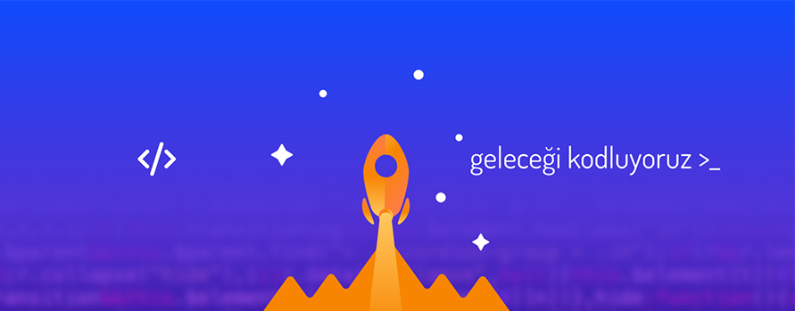

# Kodluyoruz-FronEnd Web Development Çalışmalarım

### Selam ben [***Ozan***](https://app.patika.dev/nthn)! Bu repo altında [kodluyoruz](https://www.kodluyoruz.org/) ve [patika.dev](https://app.patika.dev/) ekibi ile bootcamp hazırlık sürecinde yapmış olduğum çalışmalarım olacak. Hoşgeldin! :wave:
 ---
##  **HTML**

1.  **Kodluyoruz-HTML-Odev-1**

    Basitçe hazırlanmış hakkımda hazırlanmış bir web sayfası. 

    **İçerik:** [:floppy_disk:](HTML/Kodluyoruz-HTML-Odev-1/index.html/)

2.  **Kodluyoruz-HTML-Odev-2**

    Ödev 1 kapsamında hazırlanmış web sayfasının bazı elementler ile geliştirilmiş versiyonu.

    **İçerik:** [:floppy_disk:](HTML/Kodluyoruz-HTML-Odev-2/index.html/)

3.  **Kodluyoruz-HTML-Odev-3**

    Sevdiğimiz bir yemek ya da tatlının tarifini öğrendiğimiz bir web sitesini, HTML etiketlerini kullanarak yazmaya çalıştığımız yeni bir web sayfası tasarısı.

    **İçerik:** [:floppy_disk:](HTML/Kodluyoruz-HTML-Odev-3/index.html/)

4.  **HTML-Bolum-Sonu-Calismasi**

    HTML eğitimi boyunca öğrendiklerimizi uyguladığımız bir web sayfası çalışması.

    **İçerik:** [:floppy_disk:](HTML/HTML-Bolum-Sonu-Calismasi/)

5.  **Kodluyoruz-CSS-Odev-1**

    Bir HTML sayfası oluşturup sayfamızı CSS ile tasarımsal açıdan geliştirdiğimiz bir çalışma.

    **İçerik:** [:floppy_disk:](CSS/Kodluyoruz-CSS-Odev-1)

6.  **Kodluyoruz-CSS-Odev-2**

    İlk versiyonu 1998 yılında yayınlanmış olan Google'ın ilk versiyonunu birebir yaptığımız bir çalışma.

    **İçerik:** [:floppy_disk:](CSS/Kodluyoruz-CSS-Odev-2)
---
## **Installation**
```
git clone https://github.com/OzanYasin/Kodluyoruz-FronEnd.git
```
